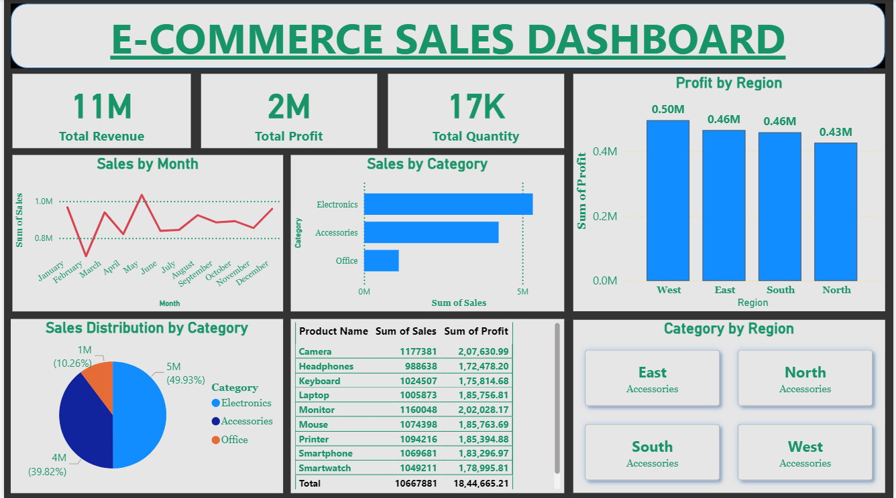
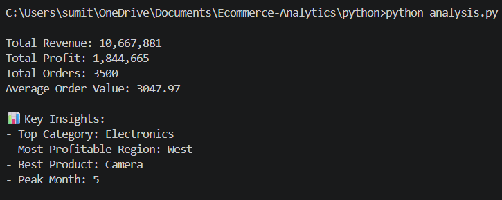
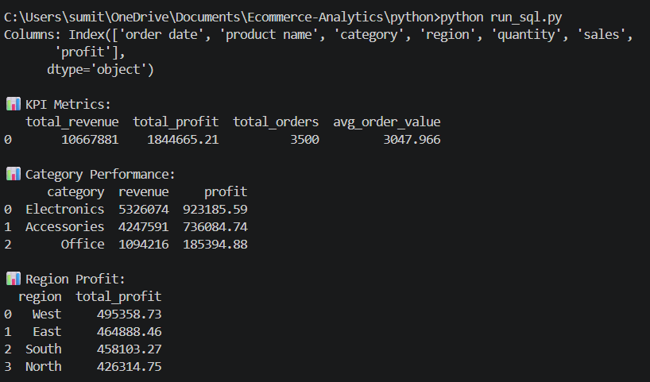
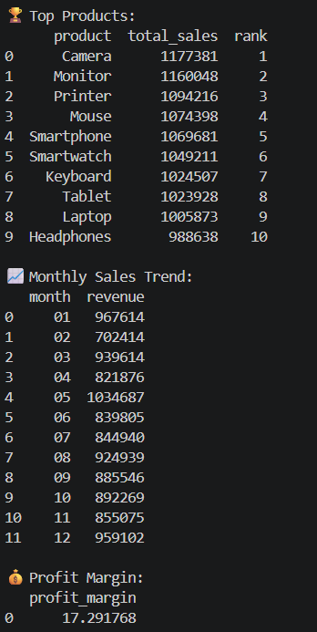

#  E-Commerce-Sales-Analytics

##  Project Overview

This project performs end-to-end e-commerce sales analysis using Python, SQL, and Power BI to generate actionable business insights.

##  Business Problem

The company wants to analyze sales performance, identify top products, and improve profitability.

##  Tools Used

- Python (Pandas, Matplotlib)
- SQL (SQLite)
- Power BI

##  Key Insights

- Electronics contributes highest revenue
- West region generates maximum profit
- Top 10 products contribute major sales
- Some products have high sales but low profit

##  Recommendations

- Focus marketing on high-performing categories
- Improve pricing strategy for low-profit products
- Increase stock for top-selling products

##  Dashboard Preview

##  Python Analysis Output

##  SQL Analysis Output

